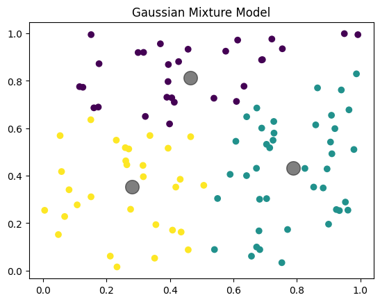
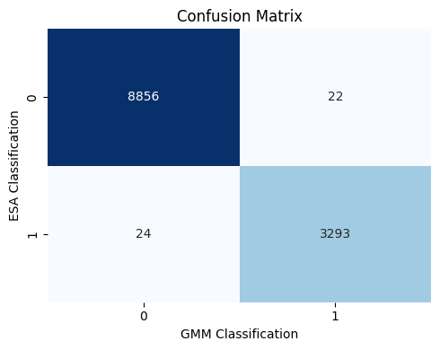

# GEOL0069_Assignments

## Week 4 – Unsupervised Learning for Sea-Ice Classification

Student: Duoduo Yi  
Module: GEOL0069 – Machine Learning in Earth Observation  

This repository contains my Week 4 assignment on unsupervised learning methods for sea-ice classification. The work focuses on applying K-means and Gaussian Mixture Models (GMM) to separate sea ice and leads using both Sentinel-2 optical imagery and Sentinel-3 SAR altimetry data. The main notebook is `Chapter1_Unsupervised_Learning_Duoduo Yi.ipynb`, which can be opened and executed in Google Colab. The README summarises the motivation, methodology and main results, while the notebook shows the full code and intermediate outputs.

---

## 1. Context and Research Rationale

Accurate discrimination between sea ice and leads (open water fractures within the ice pack) is essential for reliable sea-ice freeboard retrieval and thickness estimation. The physical interaction of radar pulses with the ocean–ice system differs strongly between open water and consolidated ice in terms of surface roughness, dielectric properties and scattering mechanisms. As a result, both the spectral reflectance in optical imagery and the shape of SAR altimetry waveforms carry information about whether the radar footprint is over ice or over a lead.

In this assignment I implement an unsupervised classification framework that aims to separate sea ice and leads without using labelled training data. Instead of fitting a supervised model to known examples, I let clustering algorithms discover natural groupings in the data. For Sentinel-2, the analysis uses stacked reflectance values from several bands to identify spectrally distinct surface types. For Sentinel-3 altimetry, the analysis relies on a set of waveform-derived parameters that summarise the shape and variability of each echo. By comparing the clustering output with the official ESA surface-type flags, I assess how well unsupervised methods can reproduce an operational discrimination between sea ice and leads.

---

## 2. Methodology Overview

Unsupervised learning refers to a family of methods that seek to uncover structure in data when no explicit labels are available. In this assignment I focus on two widely used clustering approaches: K-means and Gaussian Mixture Models. K-means partitions the dataset into a predefined number of clusters by iteratively assigning each point to the nearest centroid and updating the centroids as the mean of their assigned points. This algorithm is computationally efficient and easy to interpret, but it assumes that clusters are roughly spherical and of similar size in feature space.

Gaussian Mixture Models provide a more flexible alternative by representing the overall data distribution as a weighted sum of several Gaussian components. Each component has its own mean and covariance matrix, so clusters can take on different shapes and orientations. The model is estimated using the Expectation–Maximisation (EM) algorithm, which alternates between computing soft membership probabilities and updating the parameters of each Gaussian. Unlike K-means, GMM produces probabilistic assignments, which is useful when boundaries between classes are not perfectly sharp.

To build intuition for GMM behaviour, I first apply it to a simple two-dimensional toy dataset. The figure below shows three well-separated Gaussian clusters along with their estimated centres, highlighted as larger grey markers.

This toy example confirms that the model is able to recover the underlying cluster structure and gives a visual sense of how soft clustering assigns nearby points to the same Gaussian component.

---

## 3. Sentinel-2 Optical Sea-Ice Classification with K-means

For the optical part of the assignment I use Sentinel-2 MSI data over an Arctic sea-ice region. Several spectral bands (including B2, B3 and B4) are read from the provided SAFE product and stacked into a three-dimensional array. This cube is then reshaped so that each row corresponds to a single pixel and each column corresponds to a spectral band. Before running the clustering, invalid pixels with zero values in all bands are removed, ensuring that only meaningful observations enter the analysis.

K-means clustering with three clusters (K = 3) is applied to the stacked reflectance data. The choice of three clusters is motivated by the expectation that open water leads, consolidated sea ice and potentially a transitional or mixed surface type may occupy different regions in spectral space. After the algorithm converges, the cluster labels are reshaped back into image dimensions and visualised as a classification map, shown below.

The classification map reveals a clear separation between dark, water-like pixels and brighter, ice-like pixels. One of the clusters is predominantly associated with the narrow fractures and darker areas that correspond to leads, while the others represent different ice regimes. This demonstrates that even a simple unsupervised method such as K-means can capture the main contrast between sea ice and leads in optical imagery.

---

## 4. Sentinel-3 Altimetry Waveform Classification with GMM

The second part of the assignment focuses on Sentinel-3 SAR altimetry data. Rather than working directly with the full waveforms as very long vectors, I derive a set of compact features that describe their key morphological properties. The main parameters are sigma-0 (σ₀), which quantifies backscatter intensity, peakiness (PP), which relates the sharpness of the main echo peak to the average power level, and stack standard deviation (SSD), which captures the variability of power across the look stack. Physically, leads are expected to produce higher σ₀ and PP with lower SSD because of the specular reflection from calm open water, whereas sea-ice returns tend to be more diffuse.

After reading the relevant variables from the enhanced-measurement NetCDF file, I clean the data by filtering unrealistic values and removing missing entries. The waveform features are converted to NumPy arrays and standardised using `StandardScaler` so that each feature has zero mean and unit variance. To gain an initial impression of the waveform behaviour, I examine the distribution of echo amplitudes. The following histogram illustrates how power is concentrated around a narrow range of bins corresponding to the surface return.

I then inspect histograms for subsets of the data associated with particular clusters. For example, when focusing on echoes that will later be assigned to the lead-like cluster, the amplitude distribution becomes taller and even more concentrated around the main peak, as illustrated below.

These exploratory plots confirm that the waveform shape contains discriminative information and support the idea that simple scalar features derived from the waveforms should be sufficient for clustering.

With the features prepared, I construct a data matrix containing σ₀, PP and SSD and fit a two-component Gaussian Mixture Model, corresponding to the expected sea-ice and lead classes. The resulting cluster assignments are analysed both in feature space and in the waveform domain. Scatter plots of σ₀ versus PP, σ₀ versus SSD and PP versus SSD (shown in the notebook) reveal two clearly separated clouds of points. One cluster exhibits higher σ₀ and PP and lower SSD, consistent with leads, while the other cluster matches the characteristics of sea ice.

To further investigate the physical meaning of the clusters, I compute the mean waveform and its standard deviation for each class. The figure below shows that the “lead” cluster is associated with a much sharper and higher peak, whereas the “ice” cluster has a broader, lower-amplitude return.

This result provides strong evidence that the GMM is not only separating points numerically in feature space, but is also grouping echoes with genuinely different scattering behaviour.

Finally, I compare the unsupervised GMM classifications with the official ESA Level-2 surface-type flags. The ESA product labels sea ice as 1 and leads as 2, so I adjust these to 0 and 1 to align them with the GMM cluster indices. Using `sklearn.metrics`, I compute a confusion matrix and a standard classification report. The confusion matrix below summarises the agreement between ESA flags (rows) and GMM clusters (columns).

The majority of points lie on the diagonal, indicating excellent agreement between the two classifications. The associated precision, recall and F1 scores for both classes are very close to 1.0, and the overall accuracy is around 99–100%. This demonstrates that an unsupervised GMM applied to waveform-derived features can effectively reproduce the ESA surface-type discrimination.

---

## 5. Discussion and Conclusions

The results from both the Sentinel-2 and Sentinel-3 analyses show that relatively simple unsupervised methods are capable of separating sea ice and leads in a physically meaningful way. For optical imagery, K-means applied to stacked spectral bands produces a classification map in which lead fractures are clearly distinguished from surrounding ice. For altimetry, carefully chosen waveform-derived features (σ₀, PP and SSD) form a compact and informative representation that allows a two-component GMM to uncover the natural division between ice and leads in feature space.

An important aspect of this work is the combination of prior physical understanding with data-driven methods. The clustering algorithms themselves are generic, but the choice of features—reflectance bands for Sentinel-2 and waveform statistics for Sentinel-3—is guided by knowledge of how radar and optical sensors interact with sea ice and open water. This synergy enables unsupervised methods to achieve performance comparable to an operational, expert-designed classification product without requiring labelled training data.

Overall, the assignment illustrates how unsupervised learning can be a powerful tool for exploratory analysis in Earth observation, especially in situations where labels are expensive or unavailable. In future work, the same framework could be extended to more complex mixture models, spatial regularisation or semi-supervised approaches that combine a small number of labels with large unlabelled datasets.

---

## 6. References

Bishop, C. M. (2006). *Pattern Recognition and Machine Learning*. Springer.  

MacQueen, J. (1967). Some methods for classification and analysis of multivariate observations. *Proceedings of the 5th Berkeley Symposium on Mathematical Statistics and Probability*.
